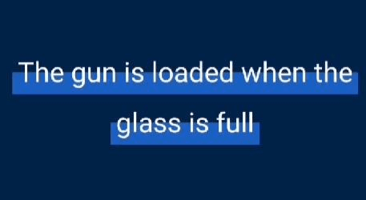

# Stranger TextView

[](https://app.codacy.com/app/MickaelCalatr/StrangerTextView?utm_source=github.com&utm_medium=referral&utm_content=MickaelCalatr/StrangerTextView&utm_campaign=Badge_Grade_Dashboard)

[  ](https://bintray.com/calatr/StrangerTextView/strangertextview/1.1/link)

This is a simple textView kotlin library for android API 15+. This library can highlight a word or an entire textView.

This is how it looks in standard mode but you can configure it as you want.



Using this library, you can add margin on the span on top, bottom, start and end.

## Dependency
Just and this line in your dependencies project.
```gradle
dependencies {
  implementation 'com.antartic.strangertextview:strangertextview:1.1'
}
```
## Usage
You can create your own view in xml like this.

```xml
<com.antartic.strangertextview.StrangerTextView
      android:id="@+id/titleTextView"
      android:layout_width="wrap_content"
      android:layout_height="wrap_content"
      android:layout_gravity="center"
      android:text="The gun is loaded when the glass is full"
      android:textColor="#FFFFFF"
      app:animated="true"
      app:color="#1763C4"
      app:marginBottom="-5dp"
      app:marginEnd="-5dp"
      app:marginStart="-5dp"
      app:marginTop="15dp"/>
```

StrangerTextView extend from AppCompatTextView the you can use it like a normal TextView.
But you can add some kind of span in background like this:
```java
StrangerTextView titleTextView = (StrangerTextView) findViewById(R.id.title_text_view)

titleTextView.spans = listOf(Pair(0, 5), Pair(10, 15))
```
In this example, the background will start from the first character to the 5th and from the 10th to the 15th character.


You can start and reset the animation like this:
```java
titleTextView.startAnimation()
```
```java
titleTextView.resetAnimation()
```

You can also set a callback on backgrounds click like:
```java
titleTextView.callback = { rect, str ->
    doWhatDoYouWant(rect, str);
}
```
rect parameter is the Rect of the background, it contains the position and size of the rect.
str parameter is the string in the rect.

## Other options
In the xml definition, besides the property, you can set:

-   animated (boolean) if true, the background will be animated (like in the example)
-   color (reference) set the background color
-   image_height (dimension) set the image height
-   marginStart (dimension) set a margin on the background start. Can be negative.
-   marginEnd (dimension) set a margin on the background end. Can be negative.
-   marginTop (dimension) set a margin on the background top. Can be negative.
-   marginBottom (dimension) set a margin on the background bottom. Can be negative.
-   animationDuration (integer) set the animation animation duration.

## Version

-   1.0 Initial release


## TODO

-   Adapt for java language.

## License

```license
The MIT License (MIT)

Copyright (c) 2019 Calatraba Mickael

Permission is hereby granted, free of charge, to any person obtaining a copy
of this software and associated documentation files (the "Software"), to deal
in the Software without restriction, including without limitation the rights
to use, copy, modify, merge, publish, distribute, sublicense, and/or sell
copies of the Software, and to permit persons to whom the Software is
furnished to do so, subject to the following conditions:

The above copyright notice and this permission notice shall be included in all
copies or substantial portions of the Software.

THE SOFTWARE IS PROVIDED "AS IS", WITHOUT WARRANTY OF ANY KIND, EXPRESS OR
IMPLIED, INCLUDING BUT NOT LIMITED TO THE WARRANTIES OF MERCHANTABILITY,
FITNESS FOR A PARTICULAR PURPOSE AND NONINFRINGEMENT. IN NO EVENT SHALL THE
AUTHORS OR COPYRIGHT HOLDERS BE LIABLE FOR ANY CLAIM, DAMAGES OR OTHER
LIABILITY, WHETHER IN AN ACTION OF CONTRACT, TORT OR OTHERWISE, ARISING FROM,
OUT OF OR IN CONNECTION WITH THE SOFTWARE OR THE USE OR OTHER DEALINGS IN THE
SOFTWARE.
```
